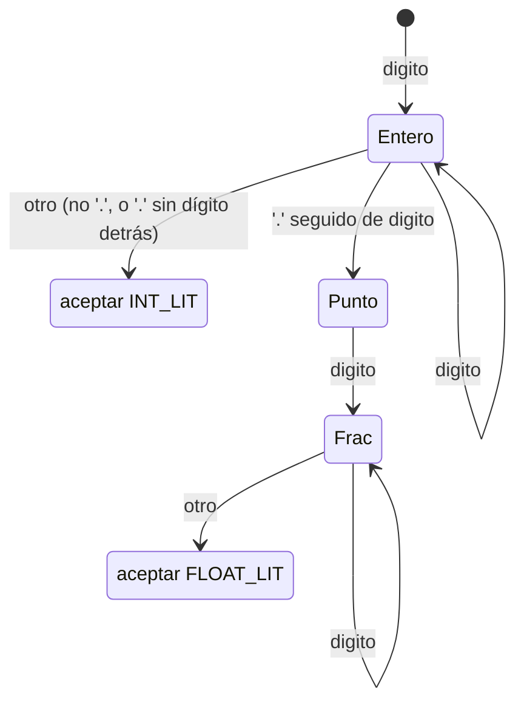

# Análisis léxico de Kel — expresiones regulares y autómatas

> **Criterio 3 de la rúbrica** — Expresiones regulares y autómatas.
>
> Como GRAMMAR.md, este documento está **derivado de `src/lexer.c`**, no
> idealizado: describe los tokens que el lexer realmente reconoce. Cada
> autómata indica la función de `lexer.c` que lo implementa, para poder
> contrastar documento y código.

El analizador léxico de Kel es un **autómata finito determinista (AFD) escrito a
mano**, dirigido por el carácter actual. `kel_tokenize` (`lexer.c:185`) es el
bucle principal: mira el carácter actual y despacha a un sub-scanner. Aplica la
regla de **máximo mordisco** (*maximal munch*): en cada punto consume la cadena
más larga que forme un token válido, usando **un carácter de anticipación**
(`peek_at(L, 1)`, `lexer.c:37`).

---

## 1. Definiciones regulares

Abreviaturas usadas en las expresiones regulares:

```
digito   = [0-9]
letra    = [A-Za-z]
```

| Token        | Expresión regular                     | Notas |
|--------------|---------------------------------------|-------|
| IDENT        | `(letra \| "_") (letra \| digito \| "_")*` | luego se consulta la tabla de palabras clave |
| INT_LIT      | `digito+`                             | sin signo (el `-` es un token aparte) |
| FLOAT_LIT    | `digito+ "." digito+`                 | el punto **debe** ir seguido de dígito |
| STR_LIT      | `"\"" [^"\n]* "\""`                    | sin secuencias de escape |
| coment. línea | `"//" [^\n]*`                        | se descarta |
| coment. bloque | `"/*" .*? "*/"`                     | se descarta; **no** anida |
| espacio      | `[ \t\r\n]+`                          | se descarta |

Palabras clave (16), reconocidas como IDENT y reclasificadas por tabla
(`KEYWORDS`, `lexer.c:80`):

```
val  var  fn  return  if  else  while  for  in
true  false  println  int  float  bool  string
```

Operadores y signos (terminales literales):

```
+  -  *  /  %  =  ==  !=  <  >  <=  >=  &&  ||  !  ->  ..
(  )  {  }  [  ]  :  ,
```

---

## 2. Autómata de identificadores y palabras clave

`scan_identifier` (`lexer.c:105`). Se reconoce primero el patrón general de
identificador y **después** se consulta si el lexema es una palabra clave
(`keyword_lookup`, `lexer.c:92`). Esta es la técnica estándar: un solo autómata
para todos los identificadores, y una tabla que reclasifica los reservados —
mucho más simple que un AFD con una rama por palabra clave.

```
          letra | _                letra | digito | _
   ┌──────────────────────┐        ┌──────┐
   │                      ▼        │      ▼
(inicio) ──letra|_──▶ (S1: ident) ─┘   (bucle en S1)
                          │
                          │  otro carácter
                          ▼
                    [aceptar IDENT]
                          │
              ┌───────────┴────────────┐
              │ ¿lexema en KEYWORDS?    │
              │  sí → token de la kw    │
              │  no → TOKEN_IDENT       │
              └─────────────────────────┘
```

Expresión regular: `(letra | "_") (letra | digito | "_")*`.
Ejemplos: `x`, `_tmp`, `read_int`, `contador2`. Nota: `read_int` **no** es
palabra reservada (no está en `KEYWORDS`), así que sale como `IDENT`; es el
sistema de tipos quien lo trata como built-in.

---

## 3. Autómata de números (entero vs flotante)

`scan_number` (`lexer.c:118`). Un solo autómata decide entre `INT_LIT` y
`FLOAT_LIT`. La transición clave es la del punto: solo se toma si **tras el
punto viene un dígito** (`peek(L)=='.' && isdigit(peek_at(L,1))`,
`lexer.c:124`). Así `3.5` es flotante, pero en `3.foo` el punto no se consume y
el número queda como entero `3` (el `.` se procesa aparte).



Diagrama textual equivalente:

```
(inicio) ──digito──▶ (Entero) ──digito──▶ (Entero)   [bucle]
                        │  \
       '.' seguido de   │   \  cualquier otro carácter
       dígito           │    └────────────▶ [aceptar INT_LIT]
                        ▼
                     (Frac) ──digito──▶ (Frac)        [bucle]
                        │
                        │  cualquier otro carácter
                        ▼
                  [aceptar FLOAT_LIT]
```

Expresiones regulares:
- `INT_LIT   = digito+`
- `FLOAT_LIT = digito+ "." digito+`

Simplificaciones deliberadas de Kel v1 (todas verificables en `scan_number`):
- **Sin punto inicial**: `.5` no es un flotante (el bucle principal ni siquiera
  entra a `scan_number`; el `.` suelto da error, ver §6).
- **Sin punto final**: `3.` es el entero `3` seguido de un `.` erróneo.
- **Sin exponente** (`1e9`), **sin hexadecimal/binario**, **sin separadores**
  (`1_000`). El signo negativo se lexa como `TOKEN_MINUS` aparte.

---

## 4. Autómata de cadenas

`scan_string` (`lexer.c:133`). Reconoce `"` … `"` sin secuencias de escape: todo
lo que no sea `"` ni salto de línea forma parte de la cadena. Tiene **dos
estados de error**: salto de línea dentro de la cadena y fin de archivo antes
del cierre.

```
(inicio) ──"──▶ (Dentro) ──[^"\n]──▶ (Dentro)   [bucle]
                   │  │
              "    │  │  '\n'  → error "cadena sin cerrar"
         ┌─────────┘  │  '\0'  → error "…al final del archivo"
         ▼            ▼
   [aceptar STR_LIT]  [estado de error]
```

Expresión regular: `"\"" [^"\n]* "\""`.

Simplificación: **no hay escapes** (`\n`, `\"`, `\\`). Una `"` siempre cierra la
cadena; una barra invertida es un carácter normal. Va en «Alcances y
limitaciones» del informe.

---

## 5. Autómata de operadores con prefijo compartido

Aquí está lo interesante del *maximal munch*. Varios operadores comparten el
primer carácter, y el lexer usa un carácter de anticipación (`match`,
`lexer.c:46`) para elegir el más largo. El sub-AFD de cada prefijo:

| Carácter | Si el siguiente es… | Token largo | Si no | Token corto | Ref. |
|----------|---------------------|-------------|-------|-------------|------|
| `-`      | `>`                 | `->` ARROW  |       | `-` MINUS   | `lexer.c:223` |
| `=`      | `=`                 | `==` EQ     |       | `=` ASSIGN  | `lexer.c:231` |
| `!`      | `=`                 | `!=` NEQ    |       | `!` NOT     | `lexer.c:236` |
| `<`      | `=`                 | `<=` LTE    |       | `<` LT      | `lexer.c:241` |
| `>`      | `=`                 | `>=` GTE    |       | `>` GT      | `lexer.c:246` |
| `&`      | `&`                 | `&&` AND    |       | **error**   | `lexer.c:251` |
| `\|`     | `\|`                | `\|\|` OR   |       | **error**   | `lexer.c:256` |
| `.`      | `.`                 | `..` RANGE  |       | **error**   | `lexer.c:261` |

Diagrama del caso `-` (representativo de todos):

```
(inicio) ──'-'──▶ (S) ──'>'──────▶ [aceptar ARROW  "->"]
                   │
                   │  cualquier otro carácter (no se consume)
                   ▼
              [aceptar MINUS  "-"]
```

Nótese la diferencia entre dos grupos:
- `-  =  !  <  >` tienen un token corto **válido** si no aparece el segundo
  carácter.
- `&  |  .` **no**: un `&` suelto, un `|` suelto o un `.` suelto son errores
  léxicos, porque Kel no tiene AND/OR bit a bit ni operador punto.

Operadores y signos de **un solo carácter** (sin prefijo compartido), que van
directos a su token: `+` `*` `%` `(` `)` `{` `}` `[` `]` `:` `,`
(`lexer.c:222,228,230,266-273`).

Caso especial de `/`: **antes** de llegar al `switch`, el bucle principal
comprueba si es `//` o `/*` para tratarlo como comentario (`lexer.c:207-208`);
solo un `/` que no abre comentario llega al `switch` y produce `SLASH`.

---

## 6. Autómata de comentarios

Dos formas, ambas descartadas (no producen token):

```
// línea:   "//" ──▶ consumir hasta '\n' o EOF        (skip_line_comment,  lexer.c:166)

/* bloque:  "/*" ──▶ consumir hasta encontrar "*/"     (skip_block_comment, lexer.c:153)
                     EOF antes de "*/" → error "comentario de bloque sin cerrar"
```

El comentario de bloque **no anida**: el primer `*/` lo cierra, aunque haya
habido un `/*` en medio.

```
(inicio) ──"/*"──▶ (Dentro) ──[^*]──▶ (Dentro)
                      │  ▲                │
                    '*'  └────[^/]────────┘
                      ▼
                   (Estrella) ──'/'──▶ [fin del comentario]
                      │
                      │  EOF → error
                      ▼
                 [estado de error]
```

---

## 7. Máximo mordisco y estados de error

**Máximo mordisco.** En cada posición el lexer consume el token más largo
posible. Por eso `==` no se lee como dos `=`, ni `->` como `-` y `>`. La
anticipación de un carácter basta porque ningún token de Kel necesita mirar dos
caracteres adelante para decidir su longitud.

**Estados de error** (todos vía `error_at`, `lexer.c:70`, que marca
`had_error` y deja que el compilador aborte tras el léxico):
- carácter desconocido (p.ej. `@`, `#`, `?`) — `lexer.c:274`;
- `&`, `|` o `.` sueltos (sin su pareja) — §5;
- cadena sin cerrar (salto de línea o EOF dentro) — §4;
- comentario de bloque sin cerrar (EOF dentro) — §6.

**Fin de entrada.** Al agotar la fuente se emite un token `EOF`
(`lexer.c:281`), que el parser usa como centinela.

---

## 8. Resumen: del carácter al token

El AFD maestro de `kel_tokenize`, en pseudocódigo, es la traducción directa de
`lexer.c:197-279`:

```
mientras queden caracteres:
    c = carácter actual
    si c es espacio/tab/CR/LF      → descartar
    si c == '/' y sigue '/' o '*'  → comentario (descartar)
    si c es letra o '_'            → scan_identifier   (§2)
    si c es dígito                 → scan_number        (§3)
    si c == '"'                    → scan_string        (§4)
    en otro caso                   → switch de operadores/signos (§5)
emitir EOF
```

Este documento y GRAMMAR.md cubren juntos las dos primeras fases del compilador
(léxico y sintáctico) tal como están implementadas, y son contrastables línea a
línea con `src/lexer.c` y `src/parser.c`.
